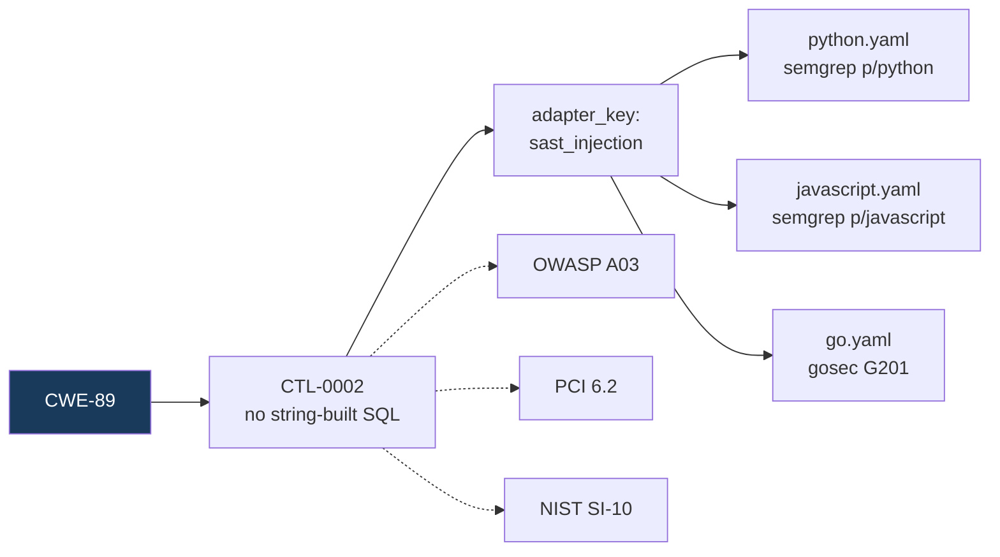

# Architecture

How the pieces fit together, and why the semantic layer cannot lie to you.

---

## 1. The whole system

```mermaid
graph TD
    S["Discussion until conclusion"] --> SPEC["`.audit/specs/NNN-slug.md`<br/>problem · decision · rejected<br/>acceptance criteria · non-goals"]
    SPEC --> DEC["`.audit/decisions.yaml`<br/>invariants that OUTLIVE this spec"]
    SPEC --> BUILD["Agent builds<br/>loads enabled SKILL.md files"]

    BUILD --> GB{"GATE B"}
    GB -->|fail| FIX["loop.sh builds correction<br/>prompt from machine output"]
    FIX --> BUILD
    FIX -.->|"budget exhausted<br/>(3 rounds)"| ESC["ESCALATE to human"]

    GB -->|pass| SEM["semantic.py<br/>advisory only"]
    SEM --> GA["GATE A<br/>change-report.md"]
    GA -->|"human rejects"| BUILD
    GA -->|"make approve"| APPROVED["approval.json<br/>bound to commit hash"]

    APPROVED --> COMMIT["pre-commit hook<br/>needs Gate B"]
    COMMIT --> PUSH["pre-push hook<br/>needs Gate B + Gate A"]
    PUSH --> CI["GitHub Actions<br/>re-runs everything clean"]

    DEC -.->|"checked on every change"| GB

    style GB fill:#1a3a5c,color:#fff
    style GA fill:#5c3d00,color:#fff
    style ESC fill:#5c1a1a,color:#fff
    style SEM fill:#2d5a27,color:#fff
```

**Gate B runs before Gate A on purpose.** Reviewing a build that is about to change five
more times is how review fatigue starts, and review fatigue turns your best gate into a
rubber stamp. The human sees the final green state, and on round 2+ sees only the delta.

---

## 2. Gate B internals

Two independent engines. Both must pass.

```mermaid
graph LR
    subgraph LOCAL["audit.py — LOCAL (reads the diff)"]
        CFG1["`.audit/config.yaml`<br/>skills + frameworks"] --> SEL["select controls"]
        CTRL["controls/*.yaml<br/>59 controls"] --> SEL
        FW["mappings/frameworks.yaml<br/>OWASP·SOC2·PCI·GDPR·NIST"] -->|filter| SEL
        SEL --> AD["adapters/*.yaml<br/>bind control to tool"]
        AD --> RUN["run scanners"]
        RUN --> LR["`.audit/last-run.json`"]
    end

    subgraph REL["coherence.py — RELATIONAL (reads the whole repo)"]
        SCAN["AST scan every file"] --> MODEL["import graph<br/>symbol table<br/>call sites<br/>structural hashes"]
        MODEL --> C510["CTL-0510 layering"]
        MODEL --> C511["CTL-0511 reverse deps"]
        MODEL --> C512["CTL-0512 duplication"]
        DECY["`.audit/decisions.yaml`"] --> C513["CTL-0513 decisions"]
        MODEL --> C514["CTL-0514 orphans"]
        C510 & C511 & C512 & C513 & C514 --> CJ["`.audit/coherence.json`"]
    end

    LR --> GATES["gates.py check"]
    CJ --> GATES

    style LOCAL fill:#0f1419,color:#fff
    style REL fill:#0f1419,color:#fff
```

Everything in both boxes is **deterministic**. Same input, same output, every run. No LLM
touches anything that can block a commit.

The distinction matters: `audit.py` answers *"is this change bad?"* — `coherence.py`
answers *"does this change clash with what already exists?"* A change can pass every
control in the first box and still make the system worse as a whole.

---

## 3. The semantic path — where DeepSeek comes in

This is the only place an LLM is involved, and every claim it makes is verified against
real files before a human sees it.

```mermaid
graph TD
    START["semantic.py"] --> EN{"`semantic_review.enabled`?"}
    EN -->|false| OFF["skip — the default"]
    EN -->|true| EX["apply `exclude_paths`<br/>cases/ evidence/ *.E01 .env"]

    EX --> MODE{"`send_source`?"}
    MODE -->|false| SIG["signatures only<br/>no bodies leave the machine"]
    MODE -->|true| FULL["full source excerpts"]

    SIG & FULL --> CTX["context = diff + symbol table<br/>symbol table comes from coherence.py,<br/>NOT from the model"]
    CTX --> API["POST /v1/chat/completions<br/>DeepSeek · Ollama · any OpenAI-compatible"]
    API --> JSON["parse strict JSON<br/>each claim MUST carry exact_quote"]

    JSON --> T1{"TIER 1 — EXISTENCE"}
    T1 -->|"file missing"| DROP["DISCARDED<br/>counted, never shown"]
    T1 -->|"line out of range"| DROP
    T1 -->|"symbol not in file"| DROP
    T1 -->|pass| T2{"TIER 2 — LITERAL"}

    T2 -->|"quote not in file"| DROP
    T2 -->|"quote >12 lines from cite"| DROP
    T2 -->|pass| GR["GROUNDED"]

    GR --> RPT["change-report.md<br/>gate A · advisory only"]
    DROP --> RATE["hallucination rate<br/>printed every run"]
    RATE --> RPT

    style T1 fill:#1a3a5c,color:#fff
    style T2 fill:#1a3a5c,color:#fff
    style DROP fill:#5c1a1a,color:#fff
    style GR fill:#2d5a27,color:#fff
    style OFF fill:#333,color:#fff
```

### Why two tiers

An LLM asked "does this duplicate existing logic?" will confidently cite a function that
does not exist, at a line number it invented, quoting code it wrote itself. A review full
of plausible fabrications is **worse than no review**, because it burns the reviewer's
trust in every finding including the true ones.

| Tier | Checks | Catches |
|---|---|---|
| 1 — Existence | file exists · line in range · symbol present in file | invented files, invented functions, hallucinated line numbers |
| 2 — Literal | `exact_quote` appears verbatim, within ±12 lines of the cited line | plausible-but-invented code, quotes from the wrong file, misattributed logic |

A claim failing either tier is **discarded and counted**. Never shown, never written to
the report, never able to block anything. The drop rate prints every run, so backend
reliability is measured rather than assumed.

Verified against seven crafted attacks in `tests/test_grounding.py`, wired into CI:
invented file, invented symbol, invented quote, line beyond EOF, missing quote — all
rejected; genuine and model-reindented quotes accepted.

### The limit, stated honestly

**The verifier proves a citation is real. It does not prove the reasoning is right.**
A grounded claim can be a wrong conclusion drawn from real code. Grounded means
*"worth looking at"*, never *"confirmed"*.

Above ~15% sustained hallucination rate, turn the layer off. A reviewer who half-trusts
findings is worse off than one with none.

### Data leaving the machine

```yaml
semantic_review:
  enabled: false            # off by default — you opt in per project
  send_source: false        # signatures only; bodies stay local
  exclude_paths:            # never sent, regardless of anything above
    - "**/cases/**"
    - "**/evidence/**"
    - "**/*.E01"
    - "**/.env*"
```

`base_url` is any OpenAI-compatible endpoint. DeepSeek, or `http://localhost:11434/v1`
for a fully local Ollama model when nothing may leave the machine at all.

---

## 4. Where state lives

Every gate decision is a file on disk. Greppable at 3am, survives crashes, no database.

| File | Written by | Purpose |
|---|---|---|
| `.audit/last-run.json` | `audit.py` | Gate B result + evidence hashes |
| `.audit/coherence.json` | `coherence.py` | Relational check results |
| `.audit/approval.json` | `gates.py approve` | Gate A, **bound to a commit hash** |
| `.audit/reports/semantic-review.json` | `semantic.py` | Grounded + discarded claims |
| `.audit/reports/change-report.md` | `report.py` | What the human reads |
| `.audit/decisions.yaml` | you | Invariants that outlive any spec |
| `.audit/waivers.yaml` | you | Accepted risk, **with an expiry** |
| `.audit/baselines/metrics.json` | `--update-baselines` | Tier-2 ratchets |

Approval binds to the commit hash. Any new commit invalidates it — otherwise "I approved
this yesterday" silently covers work done since.

---

## 5. Fail-closed guarantees

Learned the hard way; each line below is a bug that shipped and was caught in testing.

- A **crash writes a blocking artifact.** A crash previously left the *previous passing*
  result in place, and `gates.py` waved the commit through. Crashes are failures.
- A **missing tool is `[ERR]`, not `[PASS]`.** Reported as *not checked*, with the tool
  named. `Gate B: PASSED on 5 checked, 9 UNVERIFIED` is not a pass.
- **Zero coverage fails.** If no control actually executed, that is not success.
- **Freshness is by content**, not clock: `gates.py` compares the diff hash, so an
  artifact from a different diff cannot satisfy the gate.
- **Expired waivers stop suppressing.** No expiry, no owner, no justification = invalid.
- **Tier 3 never blocks.** Judgment and LLM output are advisory, permanently.

---

## 6. Adding a stack

Controls key on **CWE**, never on a language. WCAG for accessibility. Adding a stack is
one file in `adapters/`; no control changes.



Frameworks are **filters** over this set, never separate checks. That is why covering
thirteen of them is affordable.
