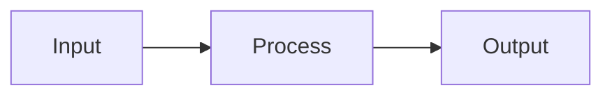

# <Project Name>

<!--
DEFAULT README STRUCTURE. Use this shape unless the user specifies otherwise or the
project genuinely doesn't fit it (a tiny CLI doesn't need an architecture section).

Delete every section that doesn't apply. An empty heading is worse than no heading.
Delete these comments as you fill each part in.

Ordering principle, borrowed from the best READMEs: what it is → what it can't do →
how it works → how to run it → how to be careful with it. A reader should be able to
stop after any section and have gained something.
-->

[](https://github.com/<user>/<repo>/actions/workflows/gates.yml)
[](LICENSE)

<!-- One paragraph. What this does, for whom, and what changes because it exists.
     No marketing. Someone deciding whether to keep reading should be able to decide
     from this paragraph alone. -->

> **Important** — <!-- The honest caveat. What this does NOT do, where it will
> mislead you, what still requires human judgement. Put it near the top, not buried
> at the bottom. A README that only sells is a README nobody trusts the second time. -->

---

## What it does

<!-- 2-4 short subsections or a bullet list. Concrete capabilities, not adjectives.
     "Parses 15 artifact types" beats "powerful parsing engine". -->

## Verified properties

<!-- OPTIONAL but high value. Claims a reader can reproduce themselves, each with the
     command that proves it. This section is what separates a README from a pitch.

     - **<claim>.** <one line on how to check it.>
       *Artifact:* [`path/to/thing`](path/to/thing)

     If you can't name a command that proves a claim, don't make the claim. -->

## Requirements

| Dependency | Version | Notes |
|---|---|---|
| | | |

## Quick start

```bash
# Install
git clone https://github.com/<user>/<repo>.git
cd <repo>

# Run
```

<!-- Someone should get to a working state from this block alone. If it needs six
     paragraphs of prose, the setup is too complicated — fix the setup, not the docs. -->

## How it works

<!-- Architecture. Use a mermaid diagram if there's real structure to show; skip it
     if there isn't. A diagram of three boxes in a row helps nobody.

     Mermaid rules learned the hard way:
       - NO backticks inside node labels. Mermaid reads them as markdown-string
         syntax and the whole diagram fails to render with a lexical error.
       - Avoid `A & B --> C` chaining; it renders inconsistently.
       - Check it renders on GitHub before you commit, or paste it into
         https://mermaid.live first. -->



## Usage

<!-- Real commands with real output. Group by what the user is trying to DO, not by
     which module the code lives in. -->

## Configuration

<!-- Only options a user actually sets. Not every constant in the codebase. -->

## Security considerations

<!-- What trust assumptions does this make? What data leaves the machine? What is it
     explicitly NOT designed to defend against? Being clear about the last one is
     more useful than a longer list of things it does defend against. -->

## Limitations

<!-- Known gaps, stated plainly, before a user discovers them the hard way.
     This section buys more credibility than any feature list. -->

- 

## Roadmap

- [ ] 

## Project structure

```
<repo>/
├── src/
├── tests/
└── docs/
```

## Tests

```bash
```

## License

<!-- MIT unless you've decided otherwise. -->

## Acknowledgments

<!-- Including honest disclosure about AI assistance if that's the case. Stating it
     plainly reads as confidence; having it discovered later doesn't. -->
